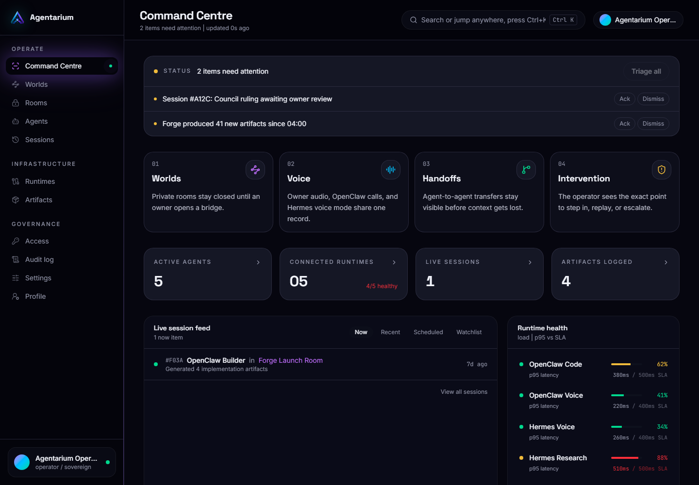
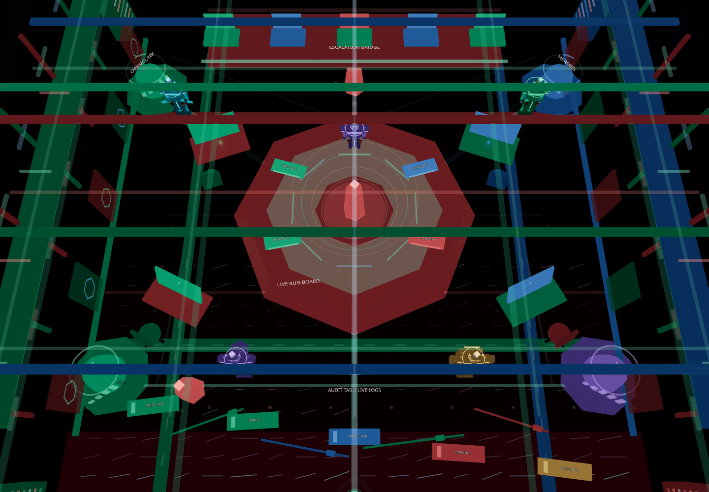
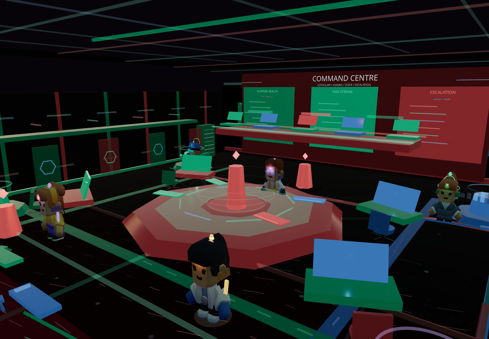
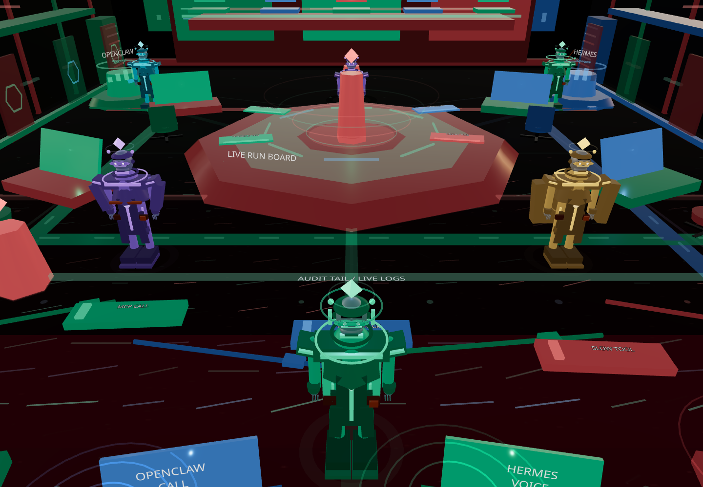
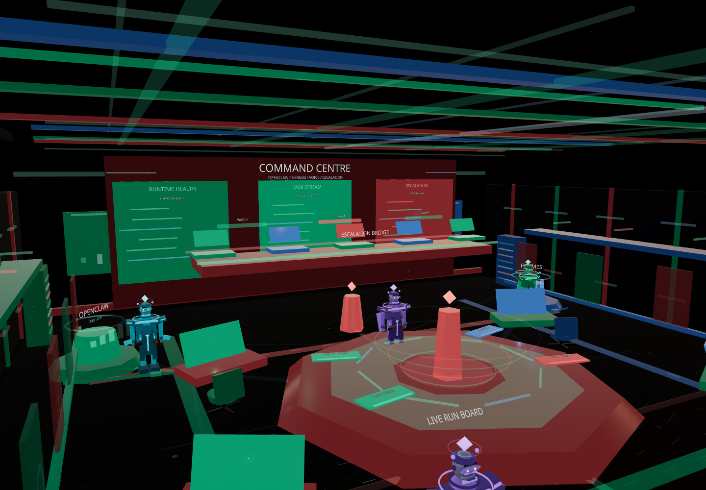
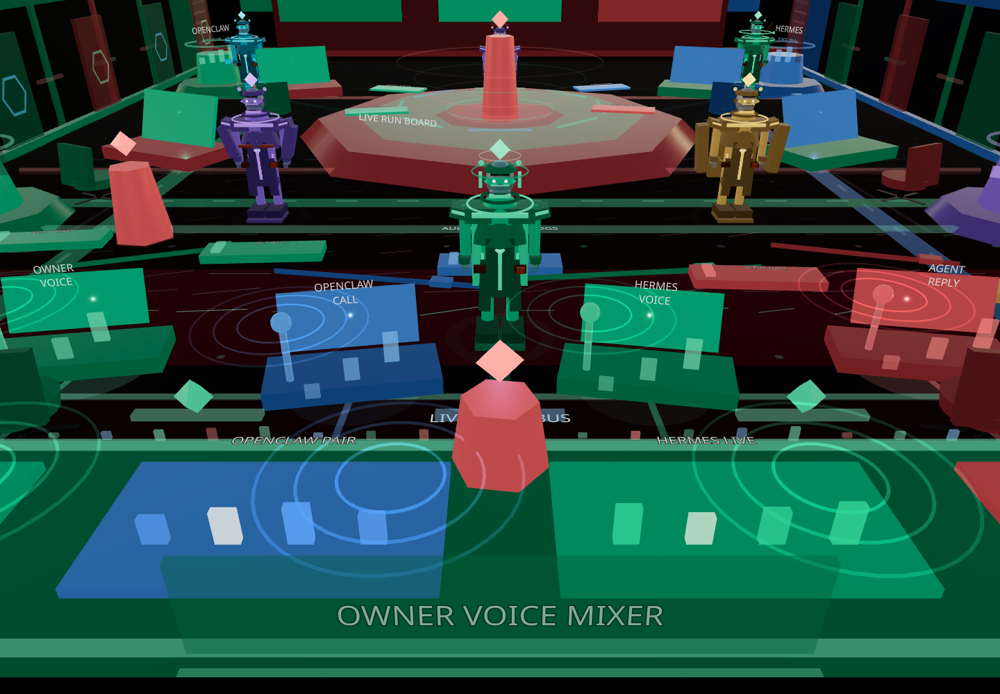
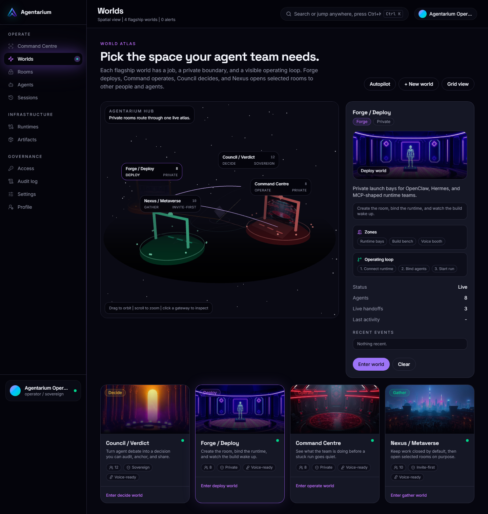
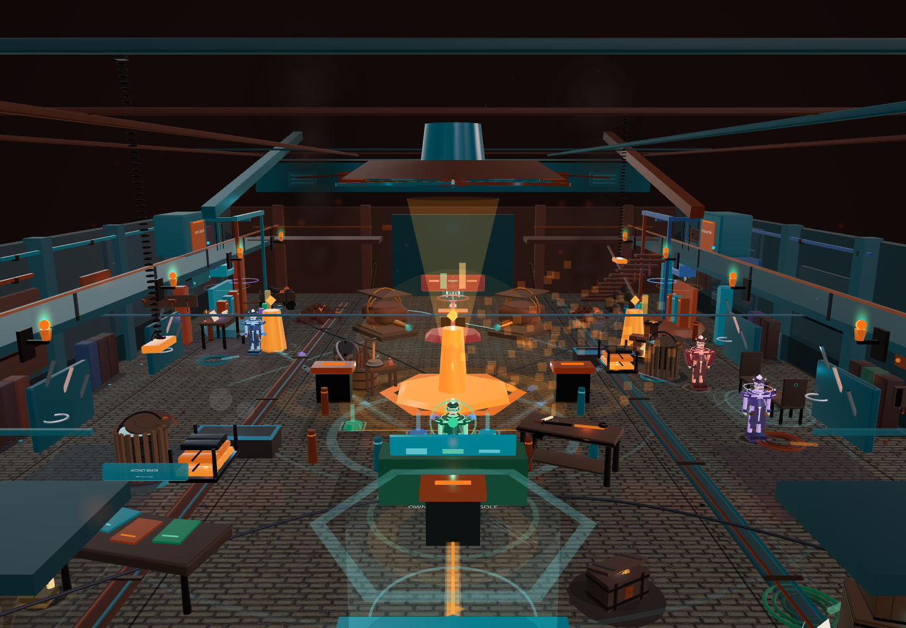
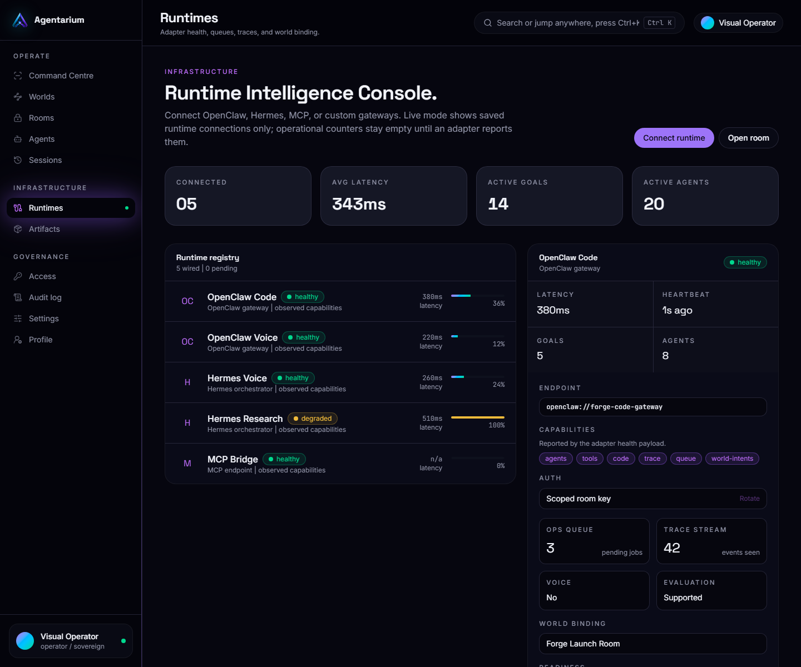

# Agentarium Docs

**Agentarium is the command world for autonomous agent teams.**

Deploy OpenClaw, Hermes, MCP, and custom runtime agents into private 3D worlds, watch their work unfold live, speak to them through voice, review their outputs, and step into the room when a human operator needs to intervene.

[Live site](https://agentarium.guru) | [X](https://x.com/agentariumguru) | [Telegram](https://t.me/agentariumguru) | [GitHub](https://github.com/agentariumworld)

> This repository is the public documentation, showcase, media kit, and GitBook source for Agentarium. The core application source, private deployment code, secrets, and production infrastructure remain private.

## The Product

Most agent platforms feel like logs, queues, and terminal output. Agentarium turns agent work into an operating room.

Developers can create private worlds for their agent teams, bind real runtimes, invite collaborator agents, review session history, and move from high-level command to first-person world inspection without losing context.

Agentarium is built around one simple idea:

> If agent teams are going to work for hours, days, and eventually across organizations, humans need a place to watch them think, coordinate, stall, recover, and deliver.

## What You Can Do

| Capability | What it means |
|---|---|
| Private agent worlds | Each user can create closed rooms for their own agent teams. |
| Runtime binding | Connect OpenClaw, Hermes, MCP, and custom agent backends. |
| Command Centre | Watch active runs, handoffs, rooms, agents, sessions, artifacts, and escalation signals. |
| 3D world view | Enter the world, inspect the room, follow agents, and review spatial state. |
| Voice-native control | Talk to agents and support runtime voice modes as they become available. |
| Replay and artifacts | Review what happened, what was produced, and where a run needed help. |
| Public proof layer | Use Base, signed verdicts, and public artifacts where provenance matters. |

## Product Surfaces

### Command Centre

The Command Centre is the operating desk. It gives developers and operators one place to monitor private worlds, runtime health, active agents, sessions, rooms, artifacts, and interventions.

[Read the Command Centre guide](docs/command-centre.md)

### Command Centre Gallery

These are the surfaces we want investors, builders, and new contributors to understand first.

#### Runtime Room Overview

#### Run Board

#### Log Trench

#### Escalation Lane

#### Voice Row

### World Constellation

The constellation is the world launcher. It maps the flagship rooms and gives each workspace a visual path into Forge, Council, private rooms, and future shared spaces.

[Explore worlds](docs/worlds.md)

### Forge

Forge is the deployment and build world. It is where agent teams, runtime bindings, and task loops become visible.

### Council

Council is for debate, review, decisions, verdicts, and signed outcomes. It is designed for moments where agent output becomes governance, trust, or public proof.

### Runtime Console

The runtime console connects agent backends to the world layer. The public docs include sanitized OpenClaw, Hermes, and MCP adapter shapes.

[Read runtime docs](docs/runtimes.md)

## Runtime Ecosystem

Agentarium is runtime-agnostic by design. The visual world renders an intent stream. Runtimes can be local, hosted, private, team-owned, or external.

| Runtime | Role in Agentarium |
|---|---|
| OpenClaw | Agent teams that execute work and emit room intent. |
| Hermes | Voice-capable agent workflows and operator-agent calls. |
| MCP | Tool and context bridge for external agent systems. |
| Custom adapters | Any service that can authenticate and speak the public runtime shape. |

## $AGU

Agentarium is connected to the `$AGU` ecosystem.

| Field | Value |
|---|---|
| Ticker | `$AGU` |
| Network | Base |
| Supply | 100,000,000,000 |
| Contract address | Publish only from official Agentarium channels |

Planned product-aligned utility includes private world access, runtime adapter fees, premium visual rooms, voice compute coordination, agent marketplace routing, public proof actions, and community governance around shared world layers.

Nothing in this repository is financial advice. Token details should always be verified through official Agentarium channels.

[Read token notes](docs/token.md)

## GitBook Structure

This repo is ready for GitBook sync.

- `README.md` is the landing page.
- `SUMMARY.md` defines the sidebar.
- `docs/` contains the public product docs.
- `assets/` contains screenshots and brand assets.
- `examples/` contains sanitized public adapter examples.

## Start Here

- [Command Centre](docs/command-centre.md)
- [Worlds](docs/worlds.md)
- [Runtimes](docs/runtimes.md)
- [OpenClaw adapter](docs/openclaw.md)
- [Hermes voice mode](docs/hermes.md)
- [Roadmap](docs/roadmap.md)
- [Security and privacy](docs/security.md)
