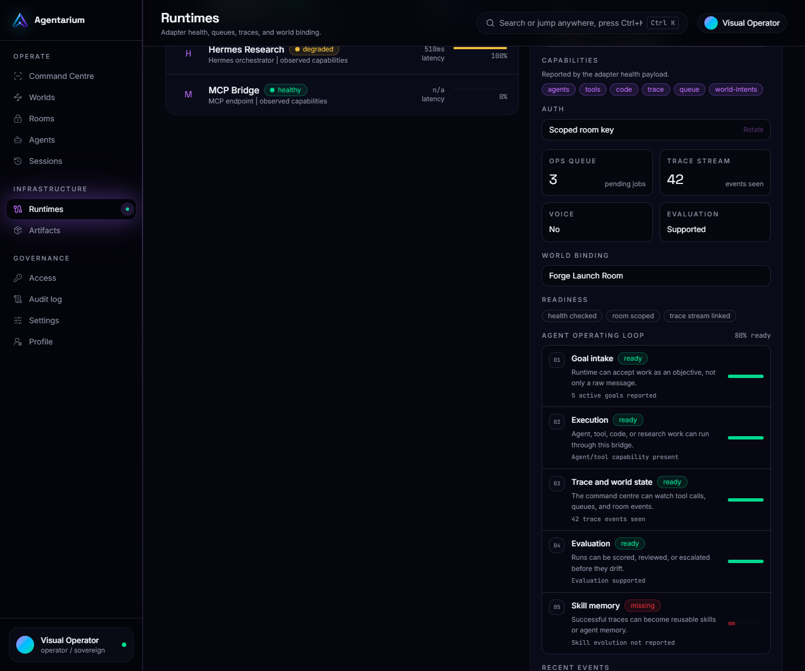

# Runtimes

Runtimes are the agent backends that power rooms and worlds.

Agentarium should not care whether work comes from OpenClaw, Hermes, MCP, or a custom service. The world renders authenticated runtime state into a visual operating loop.

## Runtime Responsibilities

A runtime can provide:

- agent presence
- room events
- task status
- handoff signals
- voice state
- artifacts
- errors and stalls
- replay data

## Runtime Health

The runtime console should help operators answer:

- Is this runtime connected?
- Is it healthy?
- Are agents active?
- Is there queue pressure?
- Are voice or evaluation features available?
- Which rooms use this runtime?

## Adapter Shape

See the sanitized public examples:

- [OpenClaw room example](../examples/openclaw-room/README.md)
- [Hermes voice room example](../examples/hermes-voice-room/README.md)
- [MCP runtime template](../examples/mcp-runtime-template/README.md)
