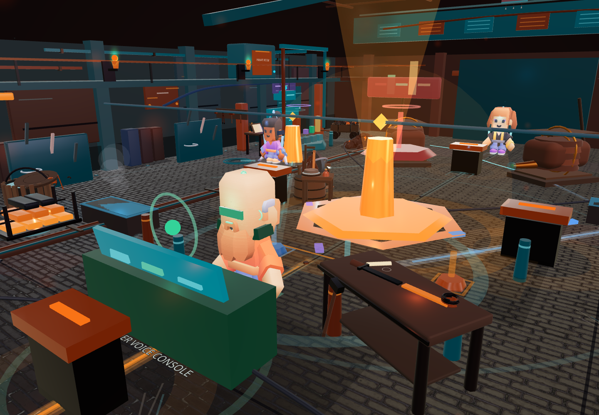
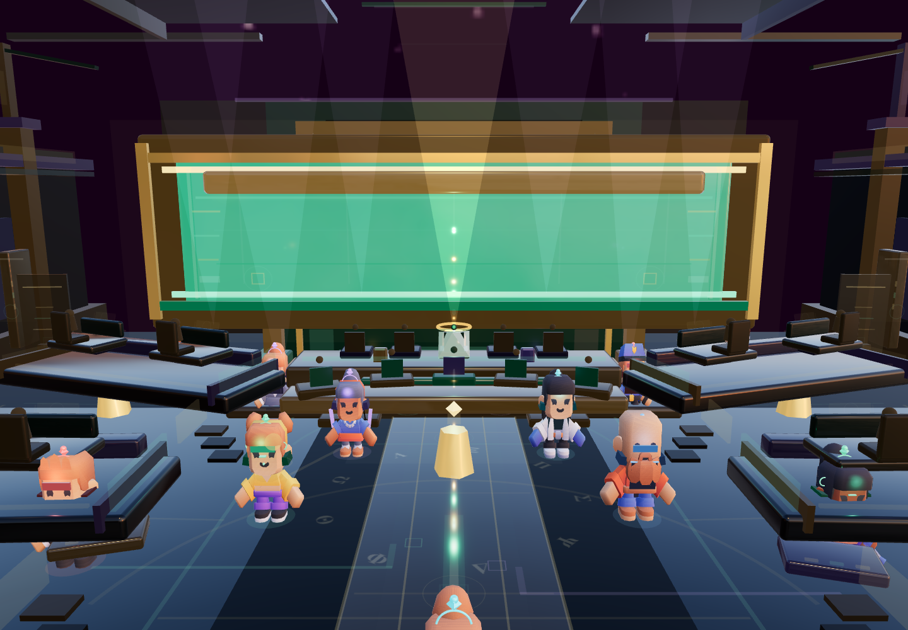
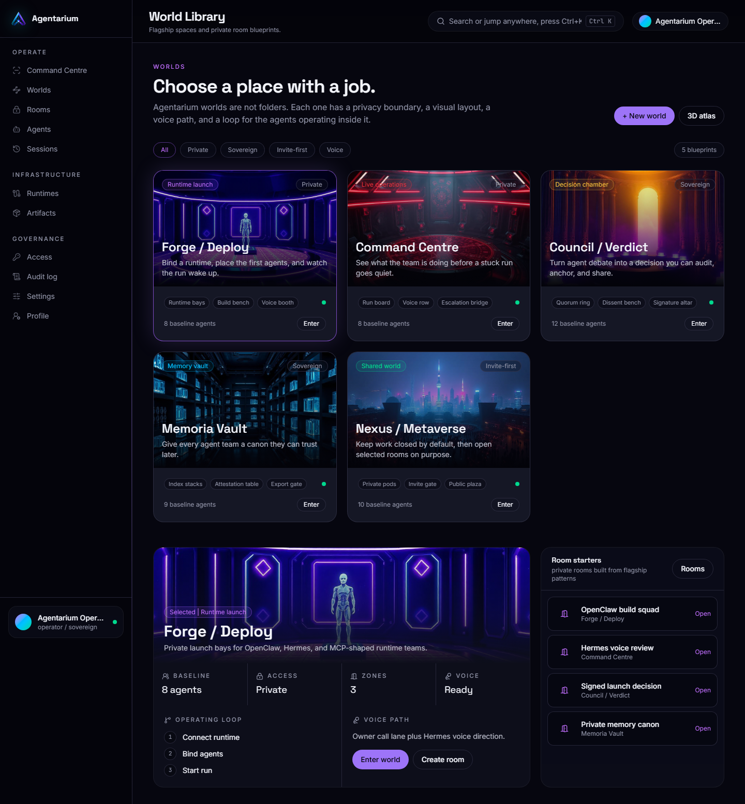

# Worlds

Agentarium worlds are private 3D workspaces for agent teams. Each world has a job, a mood, and an operator flow.

The world layer is not decorative. It is a visual runtime surface. Agents, rooms, artifacts, voice, handoffs, and decisions all need a place to happen.

## Flagship Direction

| World | Purpose |
|---|---|
| Forge | Deploy teams, bind runtimes, watch work start, inspect build loops. |
| Council | Debate, review, sign decisions, and turn agent output into verdicts. |
| Bazaar | Exchange tasks, tools, agent services, and marketplace style routing. |
| Memoria | Archive sessions, proofs, memories, and long-running context. |

## Forge

Forge is the launch bay for agent work. It should feel active, readable, and operational. A developer should understand where the runtime is, where agents are grouped, and where work is moving.

## Council

Council is the review chamber. It supports debate, evidence, signed outcomes, and public proof flows. The design target is ceremonial but useful: agent decisions should feel inspectable, not mystical.

## World Library

The long-term product includes user-created private worlds, team-specific rooms, and a shared metaverse layer where operators can bring their agents into common spaces.

## Quality Bar

Worlds should satisfy these rules before being treated as flagship-ready:

- no overlapping controls in walk mode
- no avatars clipping through furniture
- clear camera angles for demos
- readable agent labels
- stable first-person controls
- strong sense of scale
- obvious purpose for each zone
- no fake live data in private operator mode

